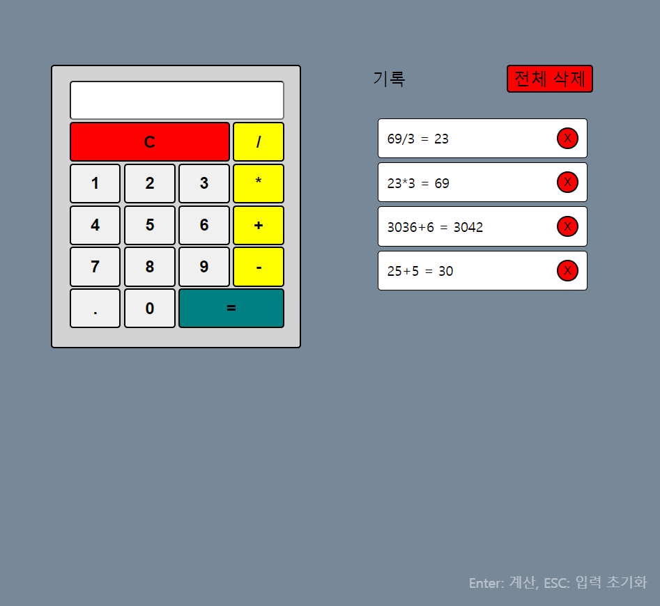

# 계산기 앱

숫자를 입력하여 기본 사칙연산이 가능한 계산기 앱.
 

# 데모 보기

https://cskim9410.github.io/calculator/

 

# 기술 구성

- This project was bootstrapped with [Create React App](https://github.com/facebook/create-react-app).
- React v18
- styled-components v5

# 앱 실행 방법

> `npm start`

 

# 22/12/11 개선사항

- [ ] 영문 한글 입력시 에러띄워주기 (정규표현식)
- [ ] esc로 clear
- [ ] 백스페이스로 뒤에서부터 지워주기
- [ ] 계산 로컬스토리지 히스토리 저장 띄워주기
- [ ] 누를때 액션추가 스케일축소
- [ ] 파비콘 변경

# 12/12//11 16:14 리뷰

- 함수명 작성할 때 동사를 앞으로 뺄 것 (동작하나만) (`numberBtnClickHandler` > `addExpression`)
- CRA 프로젝트 생성 후 쓸모없는 코드 파일 삭제 후 작업하기
- 함수의 실행 목적에 맞는 주석 작성
- 컴포넌트명 가독성 좋게 작성 (`GridContainer` > `Grid`, `RowContainer` > `Row`)
